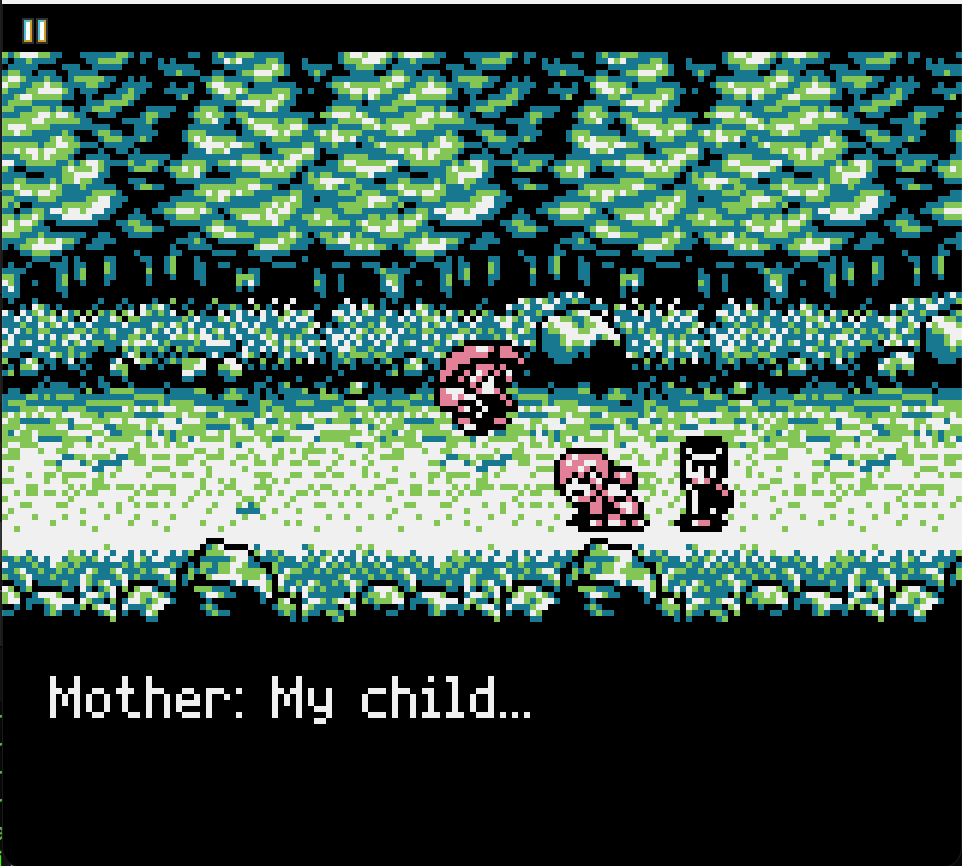
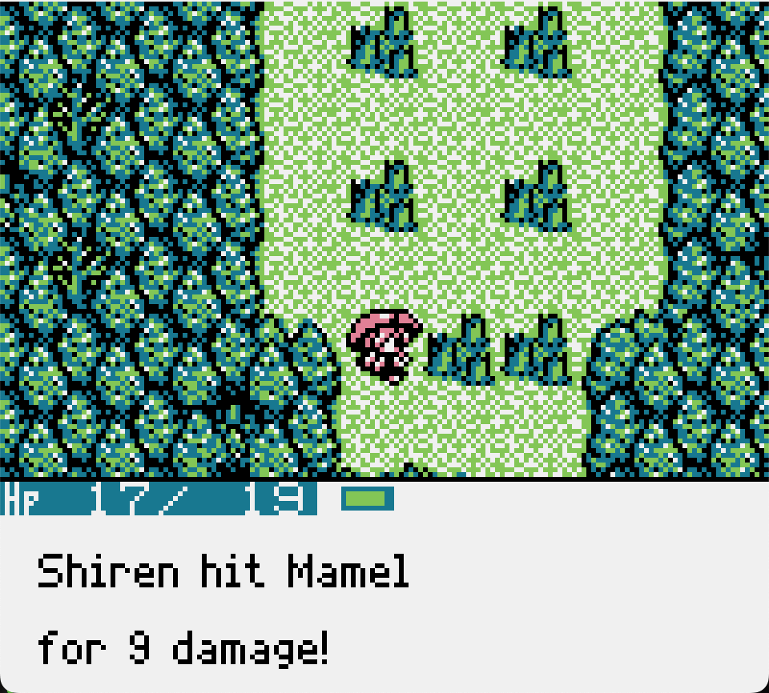
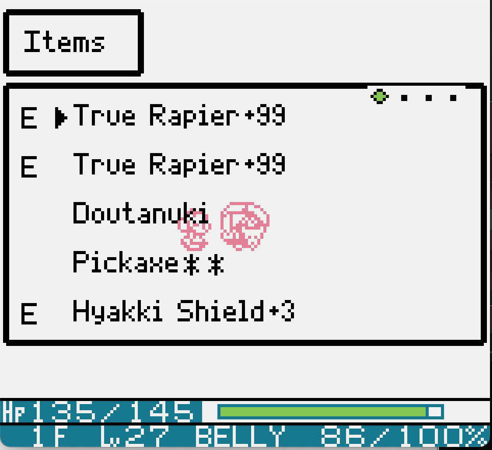
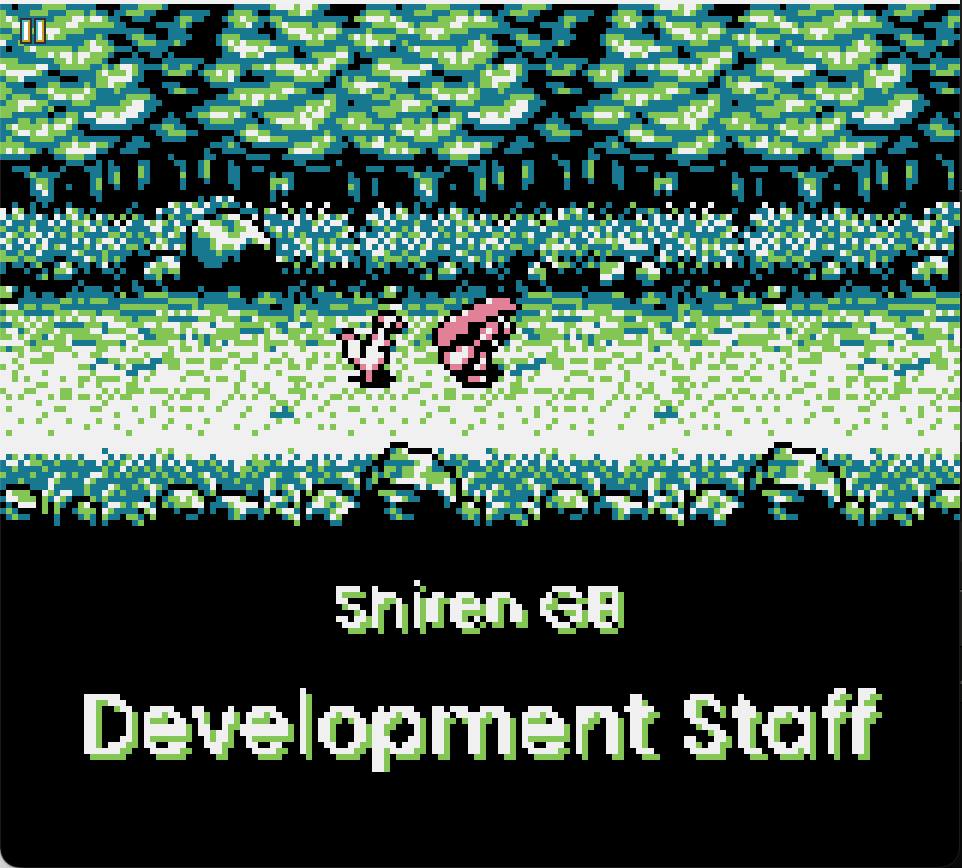

# Fuurai no Shiren GB — English translation

**Made with AI assistance.**

This is a personal, unofficial project made so I can play the game in English—and so
anyone else who wants to can do the same. Anyone may freely use this repository or use it
as the basis for a translation into any language. This is not an official release and is
not affiliated with or endorsed by the original developers or publishers. Third-party
components remain subject to the notices under [`licenses/`](licenses/).

This repository contains an English translation toolchain for **Fushigi no Dungeon:
Fuurai no Shiren GB — Tsukikage Mura no Kaibutsu** (風来のシレンGB 月影村の怪物),
Chunsoft, Game Boy, 1996. It does not contain the game ROM or extracted Japanese script.

## Showcase

Screenshots from the current English build:

| Story dialogue | Combat messages |
|:---:|:---:|
|  |  |
| **Proportional item menus** | **Translated ending credits** |
|  |  |

## Project status

| Area | State | Remaining work |
|---|---|---|
| Extracted script and cinematics | **Complete** | 1,406 of 1,424 ordinary records have supplied English; the remaining 18 records are unreachable/unrendered. All 12 separately encoded cinematic lines are translated. |
| Prose and terminology | **Build-complete; playtest ongoing** | Continue reviewing wording and newly reached event routes during full playthroughs. |
| VWF, menus, items and Rankings | **Complete for known routes** | Known dialogue, item/Floor, file, title, Rankings, status and name-entry failures have fixtures. Keep adding a regression for every playtest discovery. |
| Fonts | **Complete** | Thin Pixel-7 GB Compact is the production VWF; arrival cards use approved source rasters, and Poppins is used for credits. |
| Graphics | **Complete for known routes** | Copyright card, illustrated title, eight arrival labels, loading bubble and all 22 ending-credit cards are localized. The final Japanese end mark is intentionally retained. |
| Gameplay blockers | **None known** | Manual playtesting remains required; automated tests cannot discover every event route. |
| Release validation | **0.96 battery passed — 2026-08-16** | Continue manual playtesting before tagging or distributing a final build. |

The complete normal, shuffled and redirect-all battery passed on 2026-08-16: all 72
CPU-health seeds remained healthy, all renderer queues reached VBlank byte-exact, and
1,226,610 text-visible containment frames had zero spill. Current artifact hashes:

| Build | SHA-256 |
|---|---|
| `build/shiren_en.gb` | `2ac493bbf2136839f4f4366ce7c5848f21c045a724d188c18acb6d8255082f90` |
| `build/shiren_en_shuffle.gb` | `146be6652a2fdc2e3a40bebe49af097d342229a75c643c2964b36caf5f4042ea` |
| `build/shiren_en_redirect_all.gb` | `9581652ccea97fd90c4d9f0629edae5d4358d572d1ec77df02934cb0a4785900` |

The latest low-level memory ownership and collision rules are maintained in
[`docs/ROM_BANK_MAP.md`](docs/ROM_BANK_MAP.md). Read it before placing or moving ROM code,
tables, text or graphics. A zero-filled ROM span is not proof that the span is unused.

## Requirements

- Python 3
- [`pyboy`](https://github.com/Baekalfen/PyBoy) and Pillow:

  ```sh
  pip install pyboy pillow
  ```

- Your own Japanese ROM. The tools target this dump:

  ```text
  size   524288 bytes
  md5    754398219a3ab38394cdac543d8deb47
  sha1   920ef94c05ac741047a266cb1668c881eab2937c
  header FURAINO SIREN G
  ```

## Build

From the repository root:

```sh
mkdir -p build
cp "/path/to/Fuurai no Shiren GB (Japan).gb" build/base.gb
python3 tools/extract.py build/base.gb
sh build.sh
```

The first extraction creates the ignored `script/script.json` and `script/script.tsv`
from your ROM. The build creates the 1 MiB MBC3 ROM `build/shiren_en.gb` and should finish
with `no problems: every supplied translation fit.`

Run `extract.py` again only when extraction changes. English rows are keyed by ROM address,
so re-extraction does not overwrite the translations.

## Edit the translation

The ordinary translation is [`script/en.tsv`](script/en.tsv):

```text
13:$461A	<cE1><cE0:4C>Got <cE3>
14:$51D3	Keyaki: <name>! Waaait!
11:$548B	Strong vs Dragons
```

Look up the Japanese source in the generated `script/script.tsv`, edit the English column,
then run `sh build.sh`.

The prologue and ending cinematics use a separate VM and live in
[`script/intro.tsv`](script/intro.tsv). Edit only its `english` column. The build checks the
source metadata, controls, page count and measured 152-pixel area.

Dialogue can be drafted as sentences in [`script/prose_draft.tsv`](script/prose_draft.tsv):

```sh
python3 tools/wrap_en.py script/prose_draft.tsv --preview
python3 tools/wrap_en.py script/prose_draft.tsv --apply
```

Names and terminology belong in [`script/glossary.tsv`](script/glossary.tsv). The optional
Gemini proposal workflow is documented in
[`GEMINI_TRANSLATION.md`](GEMINI_TRANSLATION.md); model output never writes canonical TSV
without the normal review and fit gates.

### Controls and layout limits

Text does not wrap safely at runtime. Physical pixels, source staging, temporary tiles and
runtime substitutions are separate limits. The canonical budgets are in
[`VWF_BUDGETS.md`](VWF_BUDGETS.md), with full translation rules in
[`TRANSLATING.md`](TRANSLATING.md).

Anything in angle brackets is executable data and must survive:

- `<name>` — player name
- `<var>` — runtime actor/item substitution
- `<cE3>` / `<cE3:xx>` — selected item and optional selector
- `<cE4>` — runtime numeric substitution
- `<br>` — line break
- `<brk>` — page/window break
- `<end>` — message end

Do not change a dynamic token's count or order just because the English preview fits. The
native producer must supply exactly what the record consumes. See “Script-bank text is
executable data” in [`docs/ROM_BANK_MAP.md`](docs/ROM_BANK_MAP.md).

## Testing

### Ordinary build gate

After any player-visible or ROM-layout change:

```sh
sh build.sh
```

This rebuilds the normal ROM, runs static/font/coverage checks, stages the curated SRAMs,
and executes every applicable save-backed regression.

Tracked SRAM fixtures live in [`tests/fixtures/saves/`](tests/fixtures/saves/). Generated
PyBoy states live in ignored `saves/` because they include a complete emulator snapshot and
become stale when layout changes. On a fresh clone, generate and inspect them once:

```sh
sh build.sh
python3 tools/fixtures.py states build/shiren_en.gb \
    --png-dir build/fixture-state-shots
python3 tools/fixtures.py preflight --require-states
sh build.sh
```

The preflight checks fixture hashes, privacy-sensitive metadata, public player names and all
required generated states. It refuses to overwrite a different personal save at a legacy
`saves/` path.

### Complete release battery

Before tagging a release candidate, run one command:

```sh
python3 tools/release_battery.py
```

This stops at the first failure and covers:

- fixture privacy, hashes and machine-state availability;
- the full normal build and every save-backed route;
- offline translation, codec, name and renderer self-tests;
- normal, shuffled and redirect-all text placement;
- renderer timing and byte-exact VBlank upload delivery;
- 72 seeded CPU-health runs plus long dialogue-box containment sweeps;
- title, menu, item, status, Rankings, Orochi badge, death-result, rescue-exit and save-summary ownership routes.

The hostile layouts are mandatory. Redirect-all placement previously exposed a real
160-scanline VWF pass that the normal build did not; the scheduler limit is 154 scanlines.

Useful focused checks while iterating:

```sh
python3 tools/dialogue_preview.py --check
python3 tools/lint_en.py
python3 tools/varaudit.py
python3 tools/nameaudition.py
python3 tools/proptiming.py build/shiren_en.gb --frames 3000 --seeds 4
python3 tools/propupload.py build/shiren_en.gb --frames 3000 --seeds 4
python3 tools/enemyexp.py build/_base_expanded.gb build/shiren_en.gb
python3 tools/fixtures.py list
```

Focused screen regressions are named `*spill.py`. Most accept the ROM as their first
argument and document any required `--ram`, `--state`, control ROM or frame count in
`--help`. `build.sh` is the source of truth for the normal-build routes; the release runner
adds hostile placement and long seeded sweeps.

### Screens that are hard to reach

```sh
python3 tools/gbrun.py build/shiren_en.gb --frames 600 --png shot.png
python3 tools/helpshot.py build/shiren_en.gb --topic 3 --png help.png
python3 tools/sealshot.py build/shiren_en.gb --all --png seals.png
python3 tools/msgshot.py build/shiren_en.gb saves/sign.state 14:'$4638'
python3 tools/introplayback.py
```

Always inspect the built ROM in an emulator or on hardware. Automated models can be exact
and still miss an event route or visual interaction.

## Font audition

The production dialogue/menu face is **Thin Pixel-7 GB Compact**, adapted from Thin Pixel-7
version 1.0 under its freeware-use terms. Its source rows and advances are reviewable in
[`assets/fonts/thin_pixel_7_compact_glyphs.json`](assets/fonts/thin_pixel_7_compact_glyphs.json)
and [`assets/fonts/thin_pixel_7_compact.json`](assets/fonts/thin_pixel_7_compact.json).
License and provenance details are under [`licenses/`](licenses/).

Audition the production face or an external TTF/OTF/GB Studio sheet without changing the ROM:

```sh
python3 tools/fontbakeoff.py assets/fonts/thin_pixel_7_compact.json \
    --output build/thin_pixel_7_comparison.png

python3 tools/fontbakeoff.py "/path/to/candidate.ttf" \
    --output build/font_candidate.png

python3 tools/fontbakeoff.py "/path/to/candidate.png" \
    --output build/font_candidate_sheet.png
```

A GB Studio sheet must be exactly 128x112 and use its magenta width columns. Inspect at
integer zoom, especially `g/p/q/y/j`, `I/l/1`, punctuation, tabular numerals and signed
equipment suffixes. A bakeoff pass proves allocator feasibility, not aesthetic approval or
whole-game safety.

To review a serious JSON candidate against the translated corpus:

```sh
python3 tools/fontaudit.py --font-spec assets/fonts/candidate.json
```

Promoting a font requires changing the approved source/spec deliberately, then running the
complete release battery.

Arrival cards use their approved source-raster artwork. Ending credits use separately
licensed Poppins-derived graphical masks;
ordinary builds consume stable baked assets and do not depend on a system TTF.

## Arrival card audition

Town and dungeon arrival cards are graphics, not script text. Audition the installed
English artwork, or the Japanese originals it replaces, without changing the ROM:

```sh
python3 tools/markerpreview.py             # English, 8 forms -> build/arrival_cards_source.png
python3 tools/markerpreviewjp.py           # Japanese, all 25 cards -> build/arrival_cards_japanese.png
python3 tools/markerpreviewjp.py --forms   # Japanese, 8 forms -> build/arrival_cards_japanese_forms.png
```

`markerpreview.py` reads the same source-raster masks as the ROM installer, so its sheet
auditions the replacement artwork directly.

The Japanese card cannot simply be read out of the ROM. Bank 31 composes it at runtime
from a background fill, an optional floor number, and a place name built from 16x16
glyphs, so the game has to draw it. `markerpreviewjp.py` therefore builds a
`--no-markers` ROM — which keeps the native cards — drives it to a real arrival using
`saves/town.state`, and forces each selector/floor pair at the card entry the way
`floormarkerspill.py` does. The first run leaves `build/arrival_cards_native.gb` behind
and reuses it; delete it to rebuild.

Both tools paint through the same helper, so an English cell and a Japanese cell are
produced by identical code and compare directly. `--forms` renders the same eight cases as
`markerpreview.py` for a side-by-side sheet; the default renders every floor/name pairing
the native tables can select. Accepts `--scale` and `--columns`.

Neither is a test. `markerspill.py` and `floormarkerspill.py` prove the shipped cards.

## Repository map

```text
script/en.tsv                 ordinary English translation
script/prose_draft.tsv        sentence-form dialogue source for wrap_en.py
script/glossary.tsv           canonical item, monster and NPC terminology
script/intro.tsv              prologue/ending VM text
script/box_geometry.tsv       measured menu box geometry
script/var_domains.tsv        dynamic-value domain audit data
script/var_roles.tsv          confirmed runtime substitution roles
script/var_advisories.tsv     non-fatal runtime substitution review roles

tests/fixtures/               tracked SRAMs, hashes, routes and setup notes
tools/release_battery.py      complete release-candidate validation
tools/build.py                translation installer and verifier
tools/extract.py              Japanese-script extractor
tools/propvwf.py              dialogue VWF renderer
tools/menuvwf.py              menu/help/seal VWF renderer and allocator
tools/rankvwf.py              Rankings VWF renderer
tools/*spill.py               focused emulator regressions

docs/ROM_BANK_MAP.md          allocation ownership and collision rules
HANDOFF_NEXT.md               concise current task state
HANDOFF.md                    durable low-level traps and tooling reference
docs/archive/                 completed historical handoffs
```

Only `HANDOFF_NEXT.md` is required onboarding. The detailed documents are references, not a
reading checklist.

## Translating into another language

The toolchain is not English-specific:

1. Replace the approved font/glyph source and rerun its physical-budget audits.
2. Replace the English column in `script/glossary.tsv`.
3. Replace rows in `script/en.tsv`, using the generated `script/script.tsv` as the source.
4. Translate the `english` column in `script/intro.tsv`.
5. Run the complete release battery.

The source, tile, pixel and runtime-substitution budgets belong to the ROM and still apply
in another language.

## Known limits

- Static coverage cannot prove that no event enters the middle of an extracted parent
  record. Save-backed emulator routes remain necessary.
- The visible name-entry grid is intentionally fixed-cell because each cursor coordinate is
  a selectable character.
- The Blank Scroll is unused internal data, not an unfinished scribing screen.
- Graphics are complete for known routes; credits are graphical cards rather than ordinary
  script text.

## Contributing

Wording changes are easiest to review when accompanied by `sh build.sh` output. Code,
layout and graphics changes should add the narrowest relevant emulator regression and a
screenshot when appearance matters. Font/art submissions must identify their source and
license and use the audition workflow above.

Do not commit ROMs, extracted Japanese, generated machine states or `build/`. `.gitignore`
blocks them; if game-derived data bypasses the ignore rules, treat that as a bug.

*Distributed as tools and a translation only. You must supply your own original cartridge
dump.*
